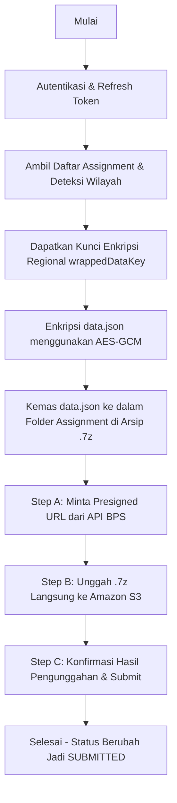

# Dokumentasi Alur Kerja (Workflow) Automasasi Fasih BPS

Dokumen ini menjelaskan alur kerja teknis dari skrip automasi `submit_fasih.py` dalam memproses pengisian kuesioner, enkripsi data, pembuatan arsip, dan pengiriman berkas ke server Fasih BPS.

---

## 1. Arsitektur Umum & Pipeline

Pengiriman kuesioner ke platform Fasih BPS mengikuti **3-Step S3 Upload Pipeline** yang meniru persis perilaku aplikasi mobile Android:



---

## 2. Rincian Teknis Langkah demi Langkah

### Langkah 1: Autentikasi & Verifikasi Token (`openid-connect`)
* Skrip membaca berkas kredensial/token `fasih_token.json`.
* Jika token kedaluwarsa, skrip melakukan pembaruan otomatis (`refresh_token`) menggunakan endpoint Keycloak SSO BPS (`/auth/realms/eksternal/protocol/openid-connect/token`).

### Langkah 2: Pencarian Penugasan & Resolusi Wilayah Dinamis
* Skrip mengambil daftar penugasan aktif dari server melalui endpoint `/mobile/assignment-sync/api/mobile/s3/assignment/datatable`.
* **Pencocokan Data**:
  * Jika menggunakan argumen langsung (`--idpel` dan `--nometer`), skrip akan memindai daftar penugasan untuk menemukan baris tugas yang memiliki kecocokan ID Pelanggan (`data3`) dan Nomor Meter (`data1`).
* **Resolusi Wilayah**:
  * Wilayah tugas target diekstraksi dari objek penugasan (Provinsi, Kabupaten/Kota, Kecamatan). Wilayah ini digunakan untuk mengisi field alamat secara dinamis (`r102a`, `r102b`, `r102c`, dst.) dan mendapatkan kunci dekripsi/enkripsi yang sesuai.

### Langkah 3: Pengambilan Kunci Enkripsi & Proteksi AES-GCM
Setiap wilayah administrasi kuesioner memiliki kunci enkripsi unik yang dibungkus oleh server (`wrappedDataKey`).
* Skrip meminta data kunci wilayah ke endpoint `/get-by-survey-periode-id`.
* Skrip mengurai kunci dasar (`wrappedDataKey`) berbasis Base64.
* Skrip melakukan enkripsi isi JSON jawaban (`data.json`) menggunakan algoritma **AES-GCM (128-bit atau 256-bit)** dengan format keluaran string terenkripsi:
  $$\text{Payload} = \text{base64}(\text{IV}) + \text{":"} + \text{base64}(\text{Ciphertext}) + \text{":"} + \text{base64}(\text{Auth Tag})$$
* Skrip juga melakukan uji verifikasi (*round-trip verification*) dengan mencoba mendekripsi kembali payload sebelum dikirim untuk menjamin integritas enkripsi.

### Langkah 4: Penyusunan Struktur Arsip `.7z`
Format struktur arsip `.7z` sangat ketat dan divalidasi oleh parser backend BPS secara asinkron.
1. Skrip membuat direktori staging sementara dengan nama sesuai **Assignment ID**.
2. Di dalam direktori tersebut, skrip menulis berkas kuesioner terenkripsi dengan nama **`data.json`** (e.g. `/tmp/staging/34ce40ef-5852-4e4a-af30-1db837d34fec/data.json`).
3. Skrip memanggil utilitas `7z` untuk mengompresi folder tersebut ke dalam berkas `[assignmentId].7z`. Hal ini menjaga hirarki folder di dalam arsip agar berkas `data.json` berada di dalam subfolder berorientasi assignment ID.

### Langkah 5: Pengiriman 3-Tahap ke S3
* **Step A (Presign URL)**: 
  Skrip meminta URL unggah khusus ke S3 dengan mengirimkan parameter nama berkas `.7z` dan assignment ID ke endpoint `/presign-url`.
* **Step B (Upload ke S3)**:
  Skrip mengunggah berkas `.7z` secara langsung ke S3 Bucket BPS menggunakan metode `PUT` HTTP dengan header `Content-Type: application/x-7z-compressed`.
* **Step C (Konfirmasi Submit)**:
  Skrip mengirimkan payload JSON final berisi informasi metadata (seperti `filename`, `md5`, koordinat `latitude`/`longitude`, dan parameter pemetaan slot data) ke endpoint `/submit` (atau `/edit` untuk penugasan yang diedit kembali) agar server memproses berkas di S3 secara permanen.

---

## 3. Skema Endpoint BPS yang Digunakan

| Aksi | Status Penugasan `OPEN` (Submit Baru) | Status Penugasan Lainnya (Edit/Update) |
|---|---|---|
| **Presigned URL** | `/api/assignment/s3/presign-url` | `/api/assignment/s3/edit/presign-url` |
| **Konfirmasi** | `/api/assignment/s3/submit` | `/api/assignment/s3/edit` |

Skrip secara cerdas mendeteksi status penugasan dari server dan mengarahkan endpoint di atas secara otomatis demi mendukung pengiriman ulang atau penyuntingan kuesioner.

---

## 4. Cara Menjalankan

### Mode Pencarian dan Preview (Dry-Run)
Gunakan opsi `--dry-run` untuk melihat data auto-fill dan region parsing yang di-generate tanpa mengirimkannya ke server:
```bash
python3 submit_fasih.py --idpel 234000320194 --nometer 14362253875 --dry-run
```

### Mode Submit Aktual
Kirim data kuesioner langsung ke server BPS:
```bash
python3 submit_fasih.py --idpel 234000320194 --nometer 14362253875
```
